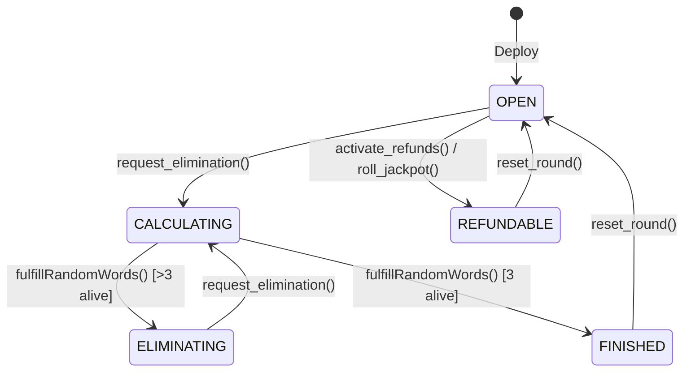

<div align="center">

# ⚔️ NodeJackPot — Viking Elimination Raffle

**A provably-fair, on-chain elimination raffle built with Vyper & Chainlink VRF 2.5**

[](https://docs.vyperlang.org/)
[](https://cyfrin.github.io/moccasin/)
[](https://docs.chain.link/vrf)
[](LICENSE)
[](#testing)

</div>

---

## 🏛️ Overview

NodeJackPot is a **Viking-themed elimination raffle** where players buy tickets at quadratic cost, and a Chainlink VRF-driven elimination engine randomly removes one participant per round until only **3 survivors remain** to split the pot:

| 🏆 Place | Split |
|----------|-------|
| 🥇 1st   | **70%** |
| 🥈 2nd   | **20%** |
| 🥉 3rd   | **10%** |

Built with security-first principles: pull-payment pattern, reentrancy guards, vesting delays, and a refund safety-switch for low-turnout rounds.

---

## 🧬 Architecture



---

## ⚡ Features

### Phase 1-2 — Entry & Quadratic Pricing
- **Quadratic ticket cost**: `(n+1)² × base_price` — discourages ticket hoarding
- Overpayment automatically returned as change
- Player profiles track tickets, alive status, and total contribution

### Phase 3 — VRF Elimination Engine
- **Chainlink VRF 2.5** for provably-fair random elimination
- Owner-triggered elimination rounds with configurable intervals
- Swap-and-pop removal for gas-efficient active list management

### Phase 4 — Rolling Jackpot & Multi-Winner Tiers
- **3-winner tiered payout** (70/20/10 split)
- **Rolling jackpot**: if a round times out with too few players, the pot carries over
- Automatic winner assignment when exactly 3 survivors remain

### Phase 5 — Payout & Vesting
- **Pull-payment pattern**: winners must actively claim their prize
- **24-hour vesting delay** for added security
- `@nonreentrant` guard on all ETH-moving functions

### Phase 6 — Refund Safety-Switch
- Activates when `total_players < MIN_ENTRANTS` after the deadline
- Players can individually claim refunds of their original contribution
- Double-refund protection via `has_refunded` flag

---

## 🛠️ Tech Stack

| Layer | Technology |
|-------|-----------|
| Smart Contract | [Vyper 0.4.3](https://docs.vyperlang.org/) |
| Auth Module | [Snekmate Ownable](https://github.com/pcaversaccio/snekmate) |
| Randomness | [Chainlink VRF 2.5](https://docs.chain.link/vrf) |
| Framework | [Moccasin](https://cyfrin.github.io/moccasin/) |
| Testing | Pytest + [Hypothesis](https://hypothesis.readthedocs.io/) Stateful Fuzzing |
| Runtime | Python ≥ 3.11 |

---

## 🚀 Quickstart

### Prerequisites

- Python 3.11+
- [uv](https://docs.astral.sh/uv/) (recommended) or pip

### Installation

```bash
git clone https://github.com/khomev/NodeJackPot.git
cd NodeJackPot
uv sync
```

### Compile Contracts

```bash
mox compile
```

### Deploy (local pyevm)

```bash
mox run script/deploy_raffle.py
```

### Deploy (Anvil)

```bash
# Terminal 1 — start Anvil
anvil

# Terminal 2 — deploy
mox run script/deploy_raffle.py --network anvil
```

---

## 🧪 Testing

### Unit Tests (45 tests)

```bash
mox test tests/unit/test_raffle.py -v
```

### Integration Tests (5 tests)

```bash
mox test tests/integration/test_raffle_integration.py -v
```

### Staging Tests (4 tests — requires Anvil)

```bash
# Start Anvil first, then:
mox test tests/staging/test_raffle_staging.py -v --network anvil
```

> Staging tests are auto-skipped on pyevm — they run against a live local node.

### Stateful Fuzzer (200 examples × 30 steps)

```bash
mox test tests/unit/test_stateful_fuzzer.py -s
```

### Full Suite with Coverage

```bash
mox test --coverage
```

### Test Coverage Map

| Phase | Function | Tests |
|-------|----------|-------|
| 1-2 | `enter_raffle()` | Entry, quadratic pricing, overpayment, wrong state |
| 3 | `request_elimination()` | Owner-only, timing, min-players, state guards |
| 3 | `fulfillRandomWords()` | Elimination, coordinator-only, state guards, finish trigger |
| 4 | `roll_jackpot()` | Jackpot roll, enough-players guard, expiry guard |
| 5 | `claim_prize()` | Vesting delay, double-claim, no-claim guards |
| 6 | `activate_refunds()` | Owner-only, expiry, min-players |
| 6 | `request_refund()` | Refund, double-refund, no-contribution |
| Admin | `reset_round()` | Post-finish reset, post-refund reset, state guards |

---

## 📁 Project Structure

```
NodeJackPot/
├── contracts/
│   ├── raffle.vy                    # Main raffle contract (all 6 phases)
│   └── mocks/
│       ├── mock_vrf_coordinator.vy  # Chainlink VRF mock for testing
│       └── link_token.vy           # LINK token mock
├── script/
│   └── deploy_raffle.py            # Deployment script
├── tests/
│   └── unit/
│       ├── test_raffle.py           # 45 unit tests (100% branch coverage)
│       └── test_stateful_fuzzer.py  # Hypothesis stateful fuzzer
├── moccasin.toml                    # Framework config
├── pyproject.toml                   # Python project config
└── README.md
```

---

## 🔐 Security Considerations

- **Reentrancy**: All ETH-moving functions use `@nonreentrant`
- **Access Control**: Owner-gated admin functions via Snekmate `ownable`
- **Pull Payments**: Winners must claim; no push-payment risks
- **Vesting Delay**: 24-hour cooldown prevents flash-loan exploitation
- **VRF Access Gate**: Only the registered coordinator can call `fulfillRandomWords`
- **Refund Safety**: Double-refund protection + state machine enforcement

---

## 📄 License

This project is licensed under the [MIT License](LICENSE).

---

<div align="center">

**Built with 🐍 by [KhomDev](https://github.com/khomev)**

</div>
